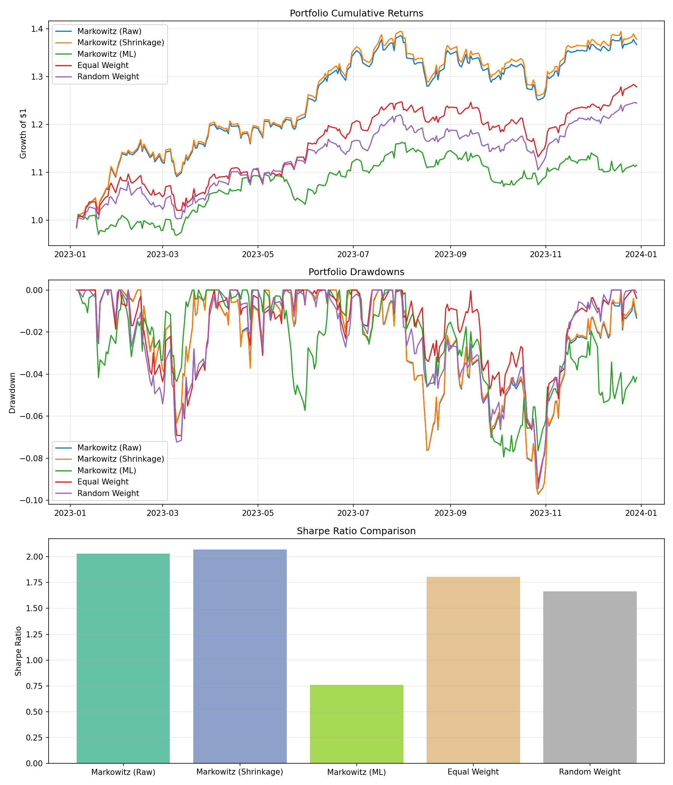
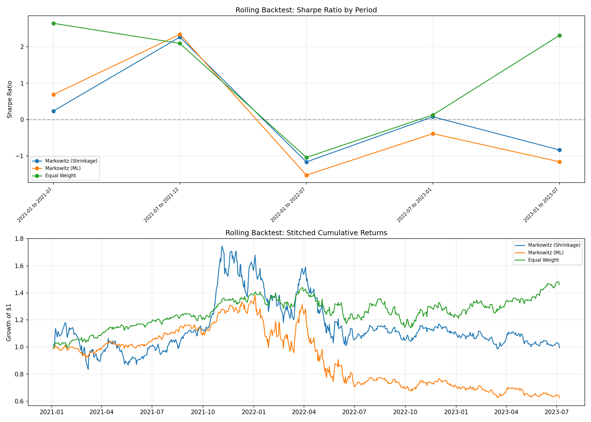
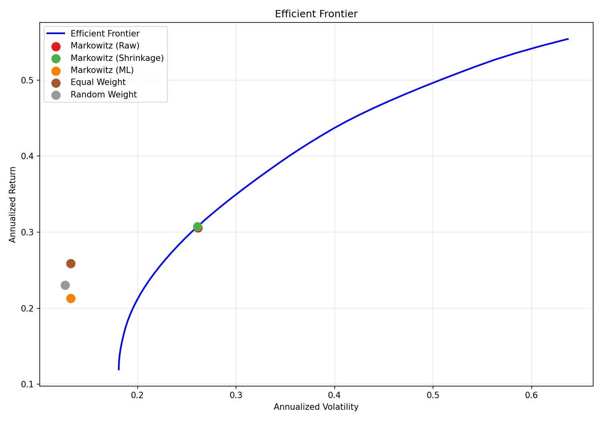

# Portfolio Optimization using Machine Learning

A portfolio optimization system that compares traditional Markowitz Mean-Variance optimization with ML-enhanced risk estimation. Built with real stock market data, tested with rolling backtests across multiple time periods.



## What This Project Does

1. Downloads historical stock prices for **18 stocks across 6 sectors** (Tech, Healthcare, Finance, Consumer, Energy, Industrials)
2. Computes risk/return estimates using three methods:
   - **Raw covariance** (baseline)
   - **Ledoit-Wolf shrinkage** (regularized estimation)
   - **ML-adjusted** (Random Forest volatility prediction + shrinkage)
3. Optimizes portfolios using Markowitz Mean-Variance to maximize the Sharpe ratio
4. Compares against equal-weight and random-weight baselines
5. Backtests on out-of-sample data with transaction costs
6. Validates robustness using **rolling window backtesting**

## Key Results

| Strategy | Total Return | Ann. Volatility | Sharpe Ratio | Max Drawdown |
|---|---|---|---|---|
| Markowitz (Raw) | 36.73% | 15.25% | 2.03 | -9.72% |
| Markowitz (Shrinkage) | 37.86% | 15.36% | 2.07 | -9.70% |
| Markowitz (ML) | 11.49% | 13.06% | 0.76 | -7.94% |
| **Equal Weight** | 27.88% | 13.23% | 1.80 | -9.19% |
| Random Weight | 24.47% | 12.65% | 1.66 | -9.46% |

**Key finding:** Shrinkage-based Markowitz achieves the highest Sharpe (2.07), but the ML-adjusted strategy achieves the lowest max drawdown (-7.94%). Simple equal-weight diversification remains competitive — a well-known result in finance called the "1/N puzzle" (DeMiguel et al., 2009).

### Rolling Backtest Results

The single-period test (2023) could be a fluke. Rolling backtests across multiple 6-month windows confirm the pattern:



| Strategy | Avg Sharpe | Avg Max Drawdown | Positive Periods |
|---|---|---|---|
| Markowitz (Shrinkage) | 0.11 | -22.55% | 3/5 |
| Markowitz (ML) | -0.01 | -18.29% | 2/5 |
| **Equal Weight** | 1.23 | -9.87% | 4/5 |

Equal-weight is the most **consistent** performer across market conditions. The Markowitz strategies deliver higher returns in favorable periods but suffer in downturns due to concentration risk.

### Efficient Frontier



## Project Structure

```
portfolio-optimization/
├── images/                        # Result plots
├── notebooks/
│   └── portfolio_analysis.ipynb   # Step-by-step walkthrough with outputs
├── src/
│   ├── data_loader.py             # Yahoo Finance data download & splitting
│   ├── feature_engineering.py     # Returns, covariance, ML volatility models
│   ├── optimization.py            # Markowitz optimization & baselines
│   └── evaluation.py              # Backtesting, metrics & visualization
├── main.py                        # Full pipeline (run this)
├── requirements.txt
└── README.md
```

## Setup

```bash
pip install -r requirements.txt
```

## Usage

**Run the full pipeline:**
```bash
python main.py
```

**Or explore interactively:**
```bash
jupyter notebook notebooks/portfolio_analysis.ipynb
```

## Methodology

### Data
- **Universe:** 18 stocks — AAPL, MSFT, GOOGL, NVDA, JNJ, UNH, PFE, JPM, V, BAC, AMZN, PG, KO, XOM, CVX, CAT, HON, TSLA
- **Period:** 2019-01-01 to 2024-01-01
- **Split:** Chronological (no look-ahead bias). Training: 2019-2022, Test: 2023

### ML Component
- **Algorithm:** Random Forest Regressor (per-stock)
- **Features:** Rolling 5-day returns, 21-day volatility, 63-day volatility
- **Target:** Forward 21-day realized volatility
- **Application:** Adjusts Ledoit-Wolf covariance matrix by scaling with predicted/historical volatility ratio

### Backtesting
- **Single-period:** Train 2019-2022, test 2023
- **Rolling:** 2-year training window, 6-month test window, rolled forward
- **Transaction cost:** 10 basis points (0.1%) applied at entry

### Evaluation Metrics
- **Sharpe Ratio** — risk-adjusted return (annualized)
- **Maximum Drawdown** — worst peak-to-trough decline
- **Total Return** — cumulative portfolio growth
- **Annualized Volatility** — standard deviation of returns (annualized)

## Technologies

- **Python** — pandas, NumPy, matplotlib
- **Finance** — yfinance, PyPortfolioOpt (Markowitz optimization)
- **Machine Learning** — scikit-learn (Random Forest)
- **Risk Models** — Ledoit-Wolf covariance shrinkage

## What I Learned

- Markowitz optimization is theoretically elegant but practically fragile — small input errors create large portfolio distortions
- ML can improve risk estimation, but the gains are incremental over simpler regularization methods
- Diversification is the only "free lunch" in finance — equal-weight portfolios are surprisingly hard to beat
- Proper backtesting (chronological splits, transaction costs, multiple periods) is essential for honest evaluation
